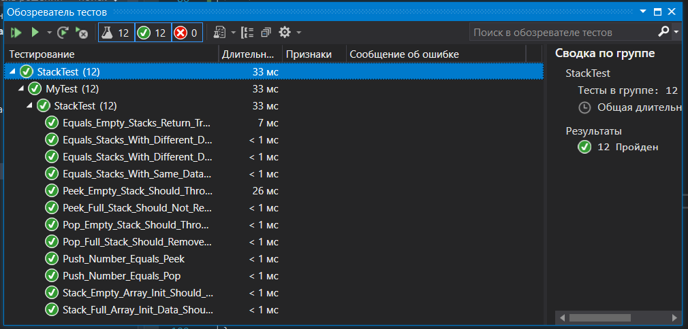

## ЛАБОРАТОРНАЯ РАБОТА №1.

### Управляемая тестами разработка классов.  
#### 39. «Стек чисел».  
Данные класса: указатель на головку стека в динамическом списке элементов стека.  
Функции класса: считывание без извлечения элемента стека, считывание с извлечением элемента стека, запись элемента в стек.  
#### Указания к выполнению заданий этой группы:  
обязательно включить в класс конструктор, использующий в качестве одного из параметров одномерный или двумерный массив чисел, конструктор преобразования реализовывать не нужно. Рекомендуется реализовать вспомогательную функцию доступа к значениям, содержащимся в списке, по их координатам и использовать эту функцию для реализации прочих функций класса. 

